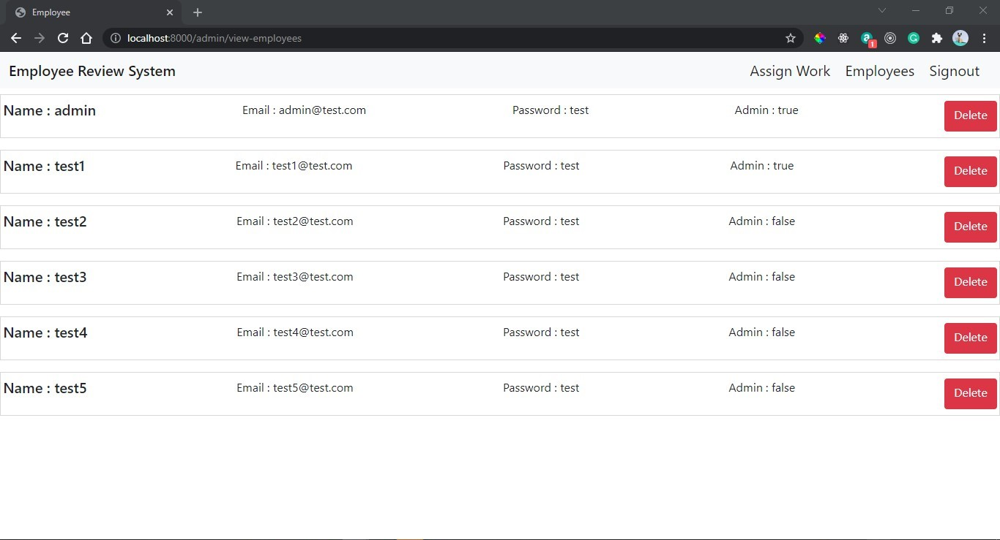
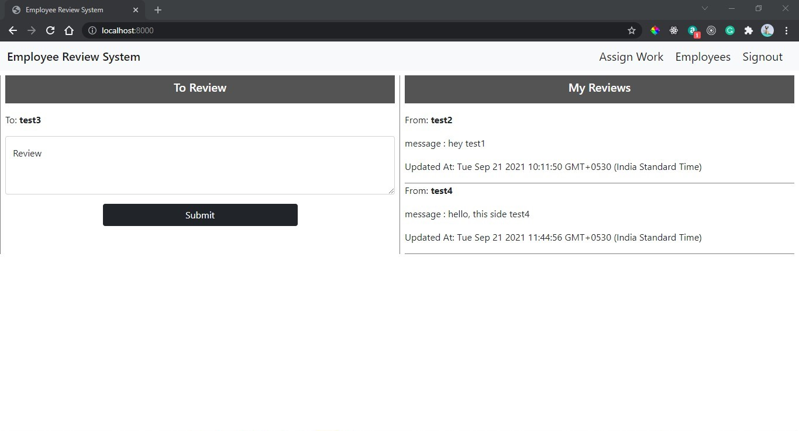
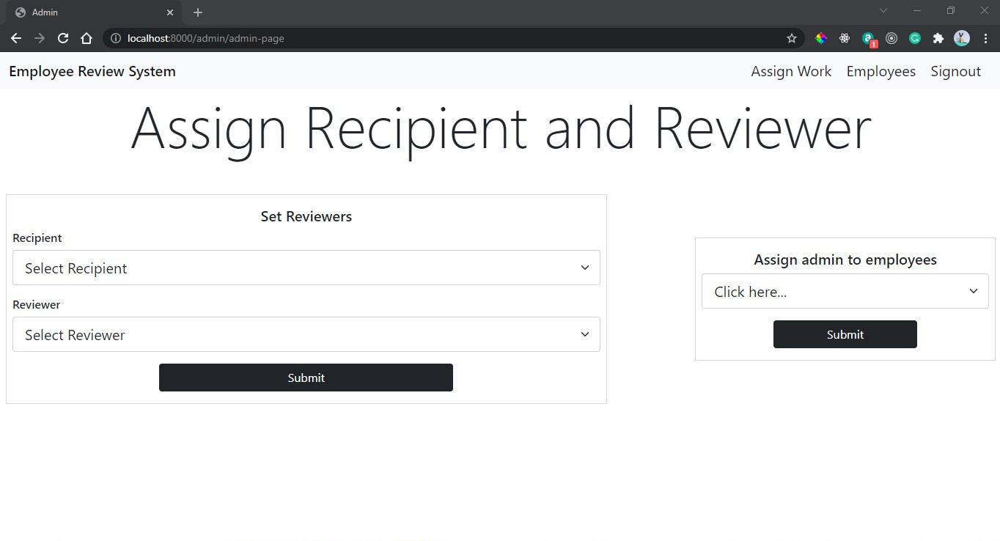
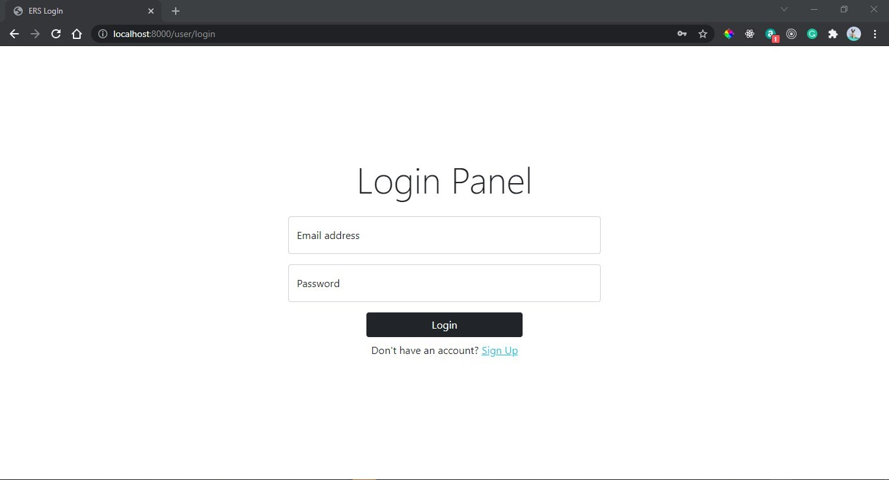
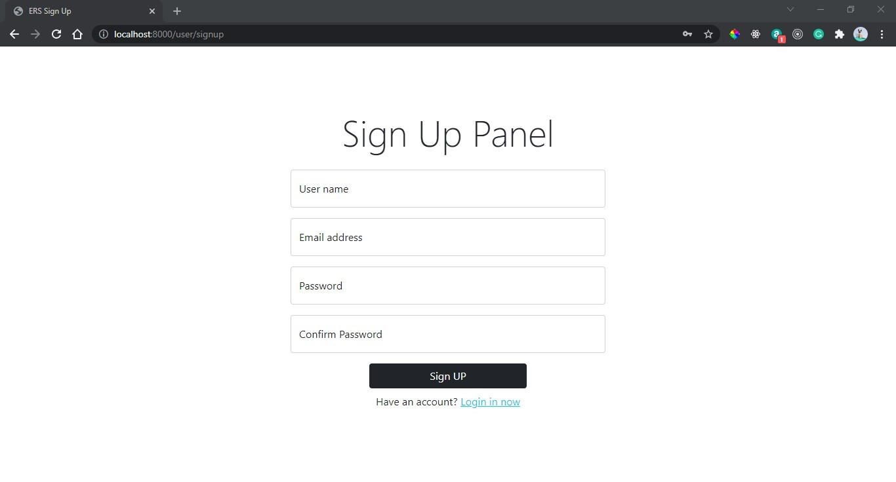

# Employee-Review-System-Node.js-App

### View this web page at : https://employee-review-system-nodejs.herokuapp.com/

### Introduction
  > Created an application that allows employees to submit feedback toward each other’s performance  
  > Authentication is needed.  

###  How to setup the project on local system

  1.  Clone this project
  2.  Start by installing npm if you don't have it already.
  3.  Navigate to Project Directory by :
  ~~~
  cd Polling-System-API
  ~~~
  4.  run following commands:
  ~~~
  npm install
  nodemon index.js
  ~~~

### Features
  * Admin View
    * Add/remove/update/view employees
    
    * Add/update/view performance reviews
    
    * Assign employees to participate in another employee's performance review
    
  * Employee view
    * List of performance review requiring feedback
    * Submit feedback
    
  * Login
    
  * SignUP
    

### Directory Structure
  `/assets/css` -  all css code 
  `/assets/img` -  all the images  
  `/config` - MongooDB Atlas Configuration  
  `/controllers`  - questions & option controllers code  
  `/model`  - question & option schemas  
  `/routes` - question & option routes  
  `/views` -  all ejs files  
  `index.js`  - entry file  
  
